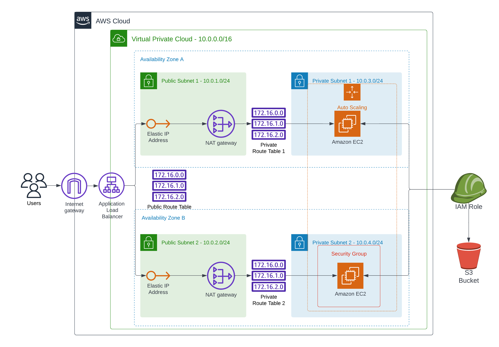

# Project 2 - Deploy a High-Availability Web App using CloudFormation

This folder containers necessary scripts and templates to automate deployment of a high availability web App on AWS using CloudFormation

## Architecture Overview

The following diagram was generated using Lucidchart and shows the infrastructure setup of this project.

Public URL of the Load Balancer -> http://serve-albwe-h5e073i73t9p-1381009789.us-east-1.elb.amazonaws.com/

